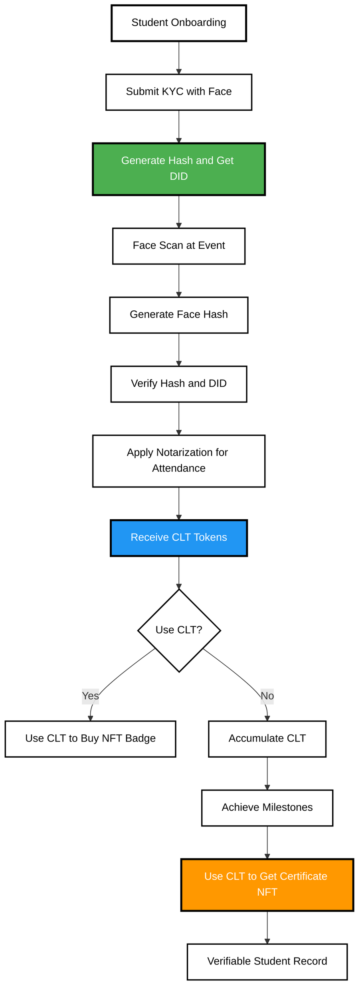

# 🎓 Cap Attendance

## 🧠 Introduction
Our project presents a decentralized system that verifies student attendance using face recognition and builds **verifiable academic credentials** on-chain — eliminating manual, spoofable attendance systems and centralized academic records.

This system uses **IOTA L1**, **DIDs**, **face-hashing**, **closed-loop tokens**, and **smart contracts** to transparently reward attendance and build a tamper-proof academic journey for each student.

---

## ✨ Inspiration
Most universities still rely on centralized, error-prone attendance and record-keeping. Students often help others "check in" with QR codes or passcodes, which weakens the integrity of attendance-based certifications.

We wanted to:
- Prevent attendance fraud
- Incentivize real participation
- Let students graduate *by their own actions*, not centralized admin approval
- Provide employers and institutions **verifiable credentials** without third-party validation

---

## ❌ Problem
- Universities use centralized databases to store attendance and transcripts
- Fake attendance (QR pass, code sharing) is rampant
- Students can't easily prove academic records across borders
- Institutions act as "gatekeepers" of a student's credentials

---

## ✅ Solution
We built a decentralized **Proof-of-Attendance System** where:
- Students **KYC once** and receive an on-chain **DID**
- Attendance is taken using **Face Recognition**, converted to a **Face Hash**
- That hash is mapped to the DID and verified using **IOTA notarization**
- Each valid attendance grants a **Closed Loop Token (CLT)**
- Students can **spend CLT on NFTs** (e.g. badges, merch, event passes)
- Gas fees are **subsidized via a Gas Station**, making Web3 onboarding seamless
- Attendance data triggers **automated certificate issuance** via smart contracts
- Over time, students "graduate" based on provable on-chain records — not admin intervention

---

## 👨‍🎓 Student Flow



---

## 🛠️ Tech Stack

| Component             | Tool/Framework                  |
| --------------------- | ------------------------------- |
| Blockchain            | IOTA L1                         |
| Identity              | Decentralized Identifier (DID)  |
| Attendance Validation | Face Recognition → Hash         |
| Gas Fee Management    | IOTA Gas Station                |
| Smart Contracts       | Move                            |
| Token Rewards         | Closed Loop Token (CLT)         |
| NFTs                  | Attendance Badges & Certificates|
| Certificate           | NFT Issuance via Smart Contract |
| Backend               | Rust / Node.js                  |
| Frontend              | React / TailwindCSS             |
| NFC Optionality       | UID–DID mapping (future work)   |

---

##  📁 Important Code Directory Structure

```bash
project-root/
│
├── contracts/                   # Move smart contracts
│   └── attendance.move          # Marks attendance and mints CLT
│
├── gas-station/                # Dockerized IOTA gas station
│   └── docker-compose.yaml     # Runs Redis + gas relay server
│
├── backend/
│   ├── server.rs               # Face hash → DID → Attendance logic
│   └── attendance_service.rs   # Smart contract caller
│
├── frontend/
│   ├── App.jsx                 # Student dashboard, QR scanner
│   └── components/
│       └── FaceScanner.jsx     # Face recognition via webcam
│
├── data/
│   └── mock_kyc_db.json        # Student DID + KYC metadata
│
└── README.md                   # This file
```

---

## 🚀 Future Implementations

* ✅ NFC Tap-to-Attend (UID maps to DID)
* ✅ Integrate zk-KYC for privacy-preserving verification
* ✅ AI Face Matching on-device (no camera footage stored)
* ✅ Real-time Certificate Verification Dashboard for employers
* ✅ Mobile App + Wallet Integration (CLT + NFTs)
* ✅ DAO-based subject approval & graduation process

---

## 🧪 Installation & Testing

### 🔧 Prerequisites

* [Rust](https://www.rust-lang.org/)
* [Move CLI](https://github.com/move-language/move)
* Docker (for gas station)
* Node.js (for frontend/backend)
* A webcam (for face hash testing)

---

### 🐳 1. Start Gas Station

```bash
cd gas-station/
GAS_STATION_AUTH=mydevtoken docker-compose up
```

---

### 🦀 2. Compile & Run Rust Backend

```bash
cd backend/
cargo run
```

---

### 🧠 3. Deploy Move Contract

```bash
cd contracts/
move build
move publish --url http://localhost:8080 --gas-station-auth mydevtoken
```

---

### 🌐 4. Start Frontend

```bash
cd frontend/
npm install
npm run dev
```

---

### ✅ 5. Test Flow

1. Register mock student via KYC
2. Launch webcam and scan face (face hash generated)
3. Hash + DID submitted to backend
4. Smart contract notarizes attendance
5. Student receives CLT
6. Use CLT to mint NFT from frontend

---

## 🏁 Contributing

Pull requests welcome! This is a hackathon MVP — we are open to contributors passionate about education, identity, and decentralization.

---

## 🛡 License

MIT

---

## 🙌 Team

Built with ❤️ at IOTA Hackathon 2025
